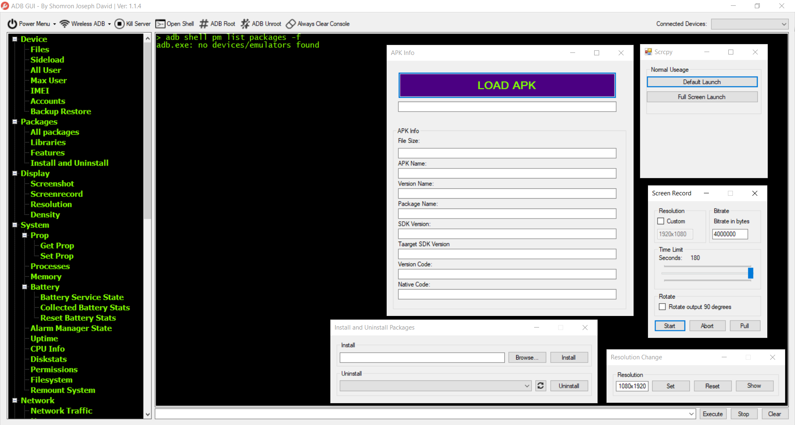

# shomronsAdbGui

## Based on [hexadezi's adbGUI](https://github.com/hexadezi/adbGUI)

This project builds upon the original work done by [hexadezi](https://github.com/hexadezi) and introduces several new features and improvements.

---

### SJD DLLs
We utilize SJD DLLs (developed by Shomrom Joseph David), a collection of bundled tools and extensions designed to ease the development process and minimize the need to rewrite code.

---

### Features & Improvements

#### Drag & Drop Functionality
- Added drag-and-drop support for Side Load, Files, and APK Info sections.

#### Code Refactoring
- Certain code blocks have been refactored into functions for cleaner, more maintainable code.

#### AAPT and AAPT2 Integration
- Integrated AAPT (Android Asset Packaging Tool) and AAPT2 into a new DLL: `sjd.apk.reader.dll`.
  - This allows for convenient information retrieval from APK packages.

#### Debugging Improvements
- Fixed a JIT Debugger - Exception Code issue that occurred on some PCs where the OEM codepage was set improperly.
- Added UTF-8 msdos codepage value insted to taking via OS.

#### APK Information
- More comprehensive APK details are now available:
  - APK Name
  - Version Name
  - Package Name
  - SDK Version
  - Target SDK Version
  - Version Code

#### Scrcpy 64-bit Support
- 64-bit support for scrcpy has been added, but more work is needed to fully integrate this feature.

  
#### Screenshots

  
